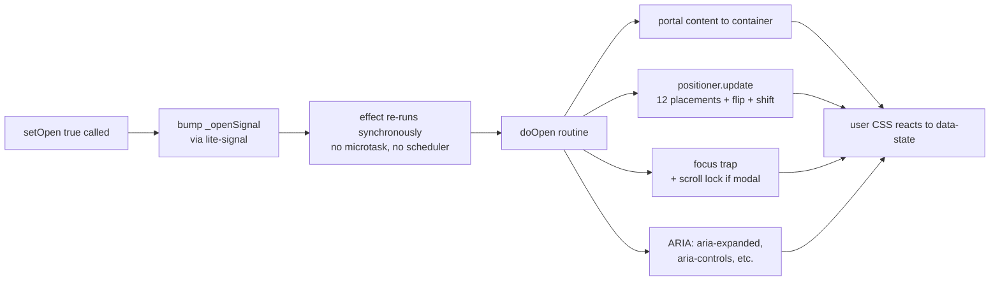
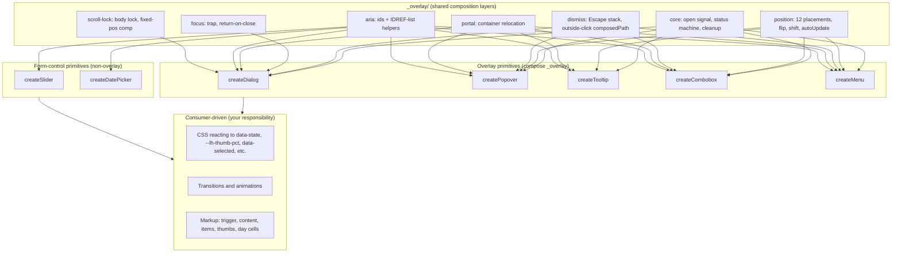
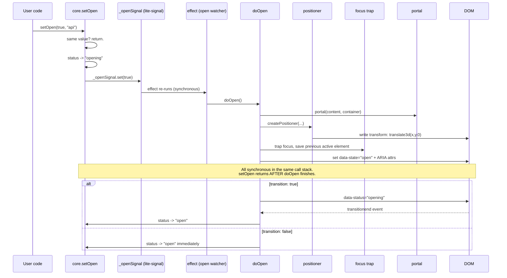
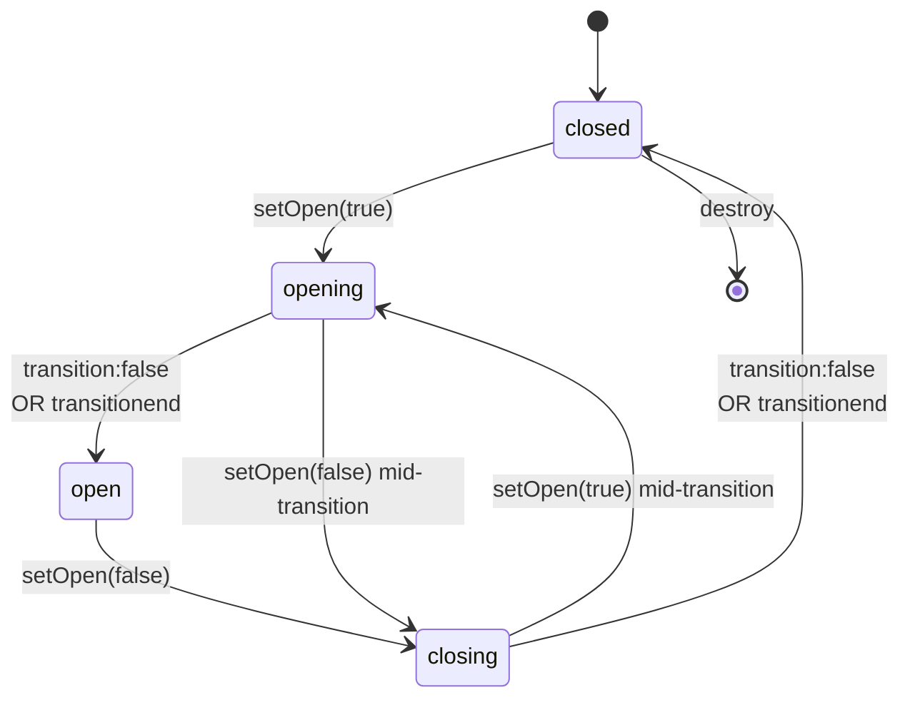

# @zakkster/lite-headless

> 58 headless UI primitives on signal-based reactivity. Overlays (dialog, alert-dialog, popover, tooltip, hover-card, menu, combobox, command-palette, toast, drawer, tour) share one composition core; form controls and data/display primitives live alongside. Each primitive ships an optional `<lite-*>` custom element. Framework-agnostic, tree-shakable, zero runtime deps, 1521 tests, MIT.

[](https://www.npmjs.com/package/@zakkster/lite-headless)
[](https://github.com/sponsors/PeshoVurtoleta)

[](https://bundlephobia.com/result?p=@zakkster/lite-headless)
[](https://www.npmjs.com/package/@zakkster/lite-headless)
[](https://www.npmjs.com/package/@zakkster/lite-headless)
[](https://github.com/PeshoVurtoleta/lite-signal)

[](./LICENSE)

```bash
npm install @zakkster/lite-headless @zakkster/lite-signal
```

```js
import { createDialog } from "@zakkster/lite-headless/dialog";

const dialog = createDialog({ modal: true, closeOnEscape: true });
dialog.attachTrigger(document.querySelector("#open-btn"));
dialog.attachContent(document.querySelector("#dialog"));

// Drive entry/exit animations from a signal:
dialog.status.subscribe((s) => {
    panel.dataset.state = s;   // "closed" | "opening" | "open" | "closing"
});

dialog.setOpen(true, "api");
```

## Current scope (v1.0.0)

> Note: the detailed prose further down this README predates the catalog
> expansion and still describes the original overlay core in depth. The
> authoritative, up-to-date facts are here and in `CHANGELOG.md`.

**58 primitives**, each a single subpath under `@zakkster/lite-headless`, each
with its own `llms.txt` (options, API, painted-attribute contract). Every
primitive also ships an optional `<lite-{name}>` custom element from
`@zakkster/lite-headless/{name}/element`.

- **Overlays** (share `_overlay/`): dialog, alert-dialog, popover, tooltip,
  hover-card, menu, combobox, command-palette, toast, drawer, tour.
- **Form controls**: slider, switch, rating, pin-input, tag-input, file-upload,
  color-picker, date-picker, stepper, inline-edit, form-field, password-input.
- **Data / display**: tabs, accordion, tree, pagination, carousel, calendar,
  kanban, sortable, timeline, descriptions, stat, meter, progress, skeleton,
  breadcrumb, badge, tag, avatar, card, banner, result, empty-state, separator,
  clipboard, notification-center.
- **Layout / util**: affix, anchor, back-top, split-panels, toolbar,
  toggle-group, steps, radio-group, picture.

**Newest additions:** `separator`, `clipboard`, `password-input`, `alert-dialog`,
and `hover-card`. `hover-card` is positioned by
[`@zakkster/lite-floating`](https://www.npmjs.com/package/@zakkster/lite-floating)
(its `autoUpdate` pulls in `@zakkster/lite-observe` transitively); both are
**optional** peers, needed only for `hover-card`. The other overlays keep the
in-house `_overlay/position` positioner. `alert-dialog` reuses the dialog
contract verbatim (`role="alertdialog"`, always modal, no backdrop-dismiss by
default).

The CSS contract is documented in [`docs/CSS_CONTRACT.md`](./docs/CSS_CONTRACT.md)
(hand-curated taxonomy) and
[`docs/CSS_CONTRACT_APPENDIX.md`](./docs/CSS_CONTRACT_APPENDIX.md)
(per-primitive, auto-generated from source).

Signal-driven, framework-free, tree-shakable. One composition core for the five overlay primitives; slider and date picker live alongside as non-overlay form controls. No scheduler queue, no microtask deferral, no styling assumptions.

---

## Table of contents

- [Why this exists](#why-this-exists)
- [What you get](#what-you-get)
- [The case for composition over inheritance](#the-case-for-composition-over-inheritance)
- [Architecture in one diagram](#architecture-in-one-diagram)
- [How an open propagates](#how-an-open-propagates)
- [API reference](#api-reference)
- [The ARIA model](#the-aria-model)
- [Status as animation contract](#status-as-animation-contract)
- [Submenu composition](#submenu-composition)
- [Edge cases pinned down](#edge-cases-pinned-down)
- [Testing strategy](#testing-strategy)
- [What this is not](#what-this-is-not)
- [Ecosystem](#ecosystem)
- [Browser and runtime support](#browser-and-runtime-support)
- [Integration recipes](#integration-recipes)
- [FAQ](#faq)
- [npm scripts](#npm-scripts)

---

## Why this exists

Overlay primitives — dialog, popover, tooltip, combobox, menu — are the most-rewritten UI components in the industry. Every team writes them; almost every team writes them wrong. The ARIA contract is dense, the focus management is fiddly, the positioning math has corners, and the dismiss model has races that bite in production.

The headless model — primitive logic, consumer styling — solves the styling tax. But existing headless libraries (Radix, Headless UI) lock you into React. The framework-agnostic ones (Floating UI, Tippy) cover one slice each.

`lite-headless` was built under three constraints simultaneously:

1. **Framework-agnostic without a wrapper tax.** Hooks into any state model via `@zakkster/lite-signal`. React, Vue, Svelte, Solid, vanilla — all pay the same cost: zero. The signal IS the state.
2. **Synchronous, predictable state transitions.** No microtask scheduling, no debounce on open. When `setOpen(true)` returns, `doOpen()` has already run, the surface is portaled, ARIA is set, focus has moved. Same call stack. Debuggable.
3. **One composition core, five primitives.** The `_overlay/` layer (core state machine, positioner, dismiss, focus, portal, ARIA, scroll-lock) is shared. Adding a new primitive (combobox, menu) is composition, not a rewrite. The positioner is ~270 lines and handles all five.



No promise between `A` and `I`. No `queueMicrotask`. Just call stack.

---

## What you get

Five primitives, each a single subpath under `@zakkster/lite-headless`:

- **`createDialog(options)`** — modal/non-modal dialogs. Focus trap, scroll lock, Escape/outside-click dismiss, label/description ARIA wiring.
- **`createPopover(options)`** — anchored panels. 12 placements, flip, shift, arrow positioning, autoUpdate via scroll capture + resize + `ResizeObserver`.
- **`createTooltip(options)`** — hover/focus tooltips. Configurable open/close delays, no focus trap, `aria-describedby` by default (toggle to `aria-labelledby`).
- **`createCombobox(options)`** — single-select listbox-style. `aria-activedescendant` pattern (focus stays on trigger), full keyboard model, typeahead with same-char cycling.
- **`createMenu(options)`** — action menus with real DOM focus, roving tabindex, `onSelect` callbacks, disabled items, separators, submenu cascade via `attachSubmenu(parentItem, submenu)`.
- **`createSlider(options)`** — first form-control primitive. Single, range, or multi-thumb (value is always an array; length determines thumb count). Full keyboard model, pointer drag via document-level listeners, CSS-variable positioning, crossing constraints, orientation + inversion. Not an overlay.
- **`createDatePicker(options)`** — second form-control. Single date or date range; consumer renders the 42-cell calendar grid via `getDaysInView()` + `attachDay(el, date)`. Full keyboard nav across month boundaries (PageUp/Down for months, Shift+Page for years, arrows traverse days/weeks), range hover preview, min/max constraints, reactive `today` for lite-time integration. Not an overlay — wrap in `createPopover` for the input-click pattern.

Each primitive ships an optional `<lite-{name}>` custom element from `@zakkster/lite-headless/{name}/element`, declarative wiring via `data-trigger` / `data-content` / `data-item` slots. The custom-element layer requires `@zakkster/lite-element` peer dep; the core primitives don't.

Three peer-dep options at install time:

| You install                          | You get                                            |
| ------------------------------------ | -------------------------------------------------- |
| `@zakkster/lite-headless` only       | All five primitive factory functions               |
| `+ @zakkster/lite-signal`            | Signal-driven `open`, `value`, `onChange` (required for runtime) |
| `+ @zakkster/lite-element`           | `<lite-dialog>`, `<lite-popover>`, ... custom elements (optional) |

Zero runtime dependencies in the published package. The peer split lets framework adapters wire their own state primitive into the same overlay logic without duplicating it.

---

## The case for composition over inheritance

<details>
<summary>Why six small layers beat one big base class; the composition-cost table.</summary>

A traditional headless library defines a base `Overlay` class with hooks for positioning, dismissal, focus, portal, and ARIA. Each primitive (Dialog, Popover, Tooltip) extends or configures it. Looks clean until you actually need composition: a combobox needs positioning + dismiss + a custom keyboard model + a value signal + `aria-activedescendant`. A menu needs positioning + dismiss + a different keyboard model + real focus + roving tabindex + submenu coordination. The base class either grows to cover every case (becomes a god object) or doesn't and you re-implement per primitive.

`lite-headless` inverts it. Six small modules under `_overlay/` each do one thing, and each primitive imports only what it needs:

| Layer               | Lines | Used by                                          | Concern                                       |
| ------------------- | ----: | ------------------------------------------------ | --------------------------------------------- |
| `_overlay/core`     |  ~190 | all five                                         | open signal, status machine, cleanup graph    |
| `_overlay/position` |  ~270 | popover, tooltip, combobox, menu                 | 12-placement positioner, flip, shift, autoUpdate |
| `_overlay/dismiss`  |  ~110 | dialog, popover, combobox, menu                  | Escape stack + outside-click composedPath     |
| `_overlay/focus`    |  ~135 | dialog (trap), all (return-on-close)             | focus trap + previously-focused-element restore |
| `_overlay/portal`   |   ~45 | all five                                         | move-to-container + DOM-position restore      |
| `_overlay/aria`     |   ~85 | all five                                         | id generation + IDREF-list token addition     |
| `_overlay/scroll-lock` | ~35 | dialog only                                      | body scroll lock + position-fixed compensation |

The total cost of a new primitive is the wiring code (~300–400 LOC) plus its own keyboard model and item registry. Combobox is 420 lines. Menu is 480. Neither duplicates positioning, dismissal, portaling, or ARIA helpers.

The composition style also means each layer is independently testable. The positioner ships with 28 tests of its own; the dismiss layer with 12; the focus trap with 9.

</details>

---

## Architecture in one diagram

<details>
<summary>The _overlay layer, the five primitives, and how data flows from setOpen to DOM.</summary>



Overlay primitives share the full `_overlay/` layer. Form-control primitives reuse only the ARIA id helpers (token-safe IDREF lists, unique-id generation); they don't portal, position, dismiss, or trap focus because none of that is part of their job. Every primitive — overlay or form-control — returns a handle with `attach*(el)` methods and `destroy()`; overlays additionally expose `open`, `status`, `setOpen`, `toggle`. Form controls expose a primitive-specific surface (slider: `value()`, `setValue(next)`).

The reactive contract is one-direction: signals → DOM. Consumer mutations to the DOM (e.g. editing item labels) do not propagate back into signals; that's the consumer's responsibility. This keeps the engine small and predictable.

</details>

---

## How an open propagates

<details>
<summary>The setOpen → effect → doOpen sequence, and why this is synchronous all the way down.</summary>



No promise between `setOpen` and the DOM mutations. No `queueMicrotask`. No scheduler. This matters for three reasons:

1. **Debuggability.** Stack traces show the full chain. When you set a breakpoint in your effect, you see who called it.
2. **Composability.** The next line after `setOpen(true)` can read the trigger's `aria-expanded` and find it's already `"true"`. No timing puzzles in tests, no `act()` wrapper.
3. **No reentrancy traps.** Because everything is in one stack, the dismissal and focus-trap installation can't race against a follow-up `setOpen(false)` from a Promise callback.

The cost: long synchronous chains. If you wire fifty effects to one signal, `setOpen` runs all fifty before returning. That's a feature in normal use (predictable cause-and-effect) and a footgun in pathological use. The engine's `maxFlushPasses` cap from `@zakkster/lite-signal` catches infinite-loop cases, but you'll feel a 50-effect chain. The recommendation: don't wire fifty effects to one signal.

</details>

---

## API reference

### `createDialog(options) -> DialogHandle`

```ts
const dialog = createDialog({
    open?:               WriteSignal<boolean>,
    defaultOpen?:        boolean,        // default false
    onOpenChange?:       (next, reason) => void,
    modal?:              boolean,        // default true
    closeOnEscape?:      boolean,        // default true
    closeOnOutsideClick?: boolean,       // default true (non-modal only meaningful)
    container?:          HTMLElement|null,    // default document.body
    transition?:         boolean,        // default false
    labelledBy?:         string,         // ID of a pre-existing label
    describedBy?:        string,         // ID of a pre-existing description
});
```

Returns: `{ open, status, setOpen, toggle, attachTrigger, attachContent, attachOverlay, attachClose, attachInside, attachTitle, attachDescription, destroy, destroyed }`.

`modal: true` traps focus inside the content and applies a body scroll lock. `closeOnOutsideClick` on a modal is a no-op (the trap intercepts pointerdown).

### `createPopover(options) -> PopoverHandle`

```ts
const popover = createPopover({
    open, defaultOpen, onOpenChange,
    placement: "bottom" | "top" | "left" | "right" |
               "bottom-start" | "bottom-end" |
               "top-start" | "top-end" |
               "left-start" | "left-end" |
               "right-start" | "right-end",        // default "bottom"
    offset:    number,                              // default 8
    flip:      boolean,                             // default true
    shift:     boolean,                             // default true
    boundary:  "clipping" | "viewport" | HTMLElement,  // default "clipping"
    modal:     boolean,                             // default false
    container, transition,
    labelledBy, describedBy,
});
```

Returns: `{ ..., attachTrigger, attachAnchor, attachContent, attachArrow, attachClose, attachInside, destroy, _positioner }`.

`attachAnchor(el)` separates the positioning anchor from the trigger (e.g. an icon button triggers, an input becomes the anchor). `attachArrow(el)` positions an arrow element relative to the resolved side. The positioner emits `data-side` and `data-align` attributes on the content so consumer CSS can rotate the arrow per side.

`boundary: "clipping"` (default) walks the parent chain from the anchor and uses the nearest scroll/overflow ancestor as the flip/shift boundary, intersected with the viewport. This means a popover inside a card with `overflow: hidden` will flip when it would exit the card, not just when it would exit the viewport. Fixed/sticky ancestors break the walk (the popover behaves as if the boundary is the viewport, which is the correct behavior for fixed descendants). For more precise control, pass `boundary: someElement` directly — the positioner uses that element's rect verbatim.

### `createTooltip(options) -> TooltipHandle`

```ts
const tooltip = createTooltip({
    open, defaultOpen, onOpenChange,
    placement, offset, flip, shift, boundary, container,
    trigger:           "hover focus" | string,     // space-separated subset of hover|focus|click|manual; default "hover focus"
    openDelay:         number,                     // ms; default 200
    closeDelay:        number,                     // ms; default 150
    describesTrigger:  boolean,                    // true -> aria-describedby; false -> aria-labelledby; default true
});
```

Focus triggers ignore delays (keyboard accessibility — Tab should reveal the tooltip instantly). The `closeDelay` is a grace period for the pointer to cross from trigger to content without dismissing.

### `createCombobox(options) -> ComboboxHandle`

```ts
const combo = createCombobox({
    open, defaultOpen, onOpenChange,
    value:           WriteSignal<any>,             // external controlled value
    defaultValue,    onValueChange,
    placement:       "bottom-start" /* default */,
    offset, flip, shift, boundary,
    typeahead:       boolean,                      // default true
    typeaheadTimeout: number,                      // ms; default 500
    loop:            boolean,                      // default true; ArrowDown at end wraps
    autoFocus:       "first" | "selected" | "none",  // default "first"
    closeOnSelect:   boolean,                      // default true
    closeOnEscape, closeOnOutsideClick, container, transition,
});
```

Returns: `{ ..., value(), setValue(v, reason), attachTrigger, attachListbox, attachItem(el, { value, label }), attachInside, destroy }`.

Uses the `aria-activedescendant` pattern: focus stays on the trigger button throughout, the trigger's `aria-activedescendant` attribute names the highlighted item's id. Keyboard model: ArrowDown/Up/Home/End move highlight, Enter selects, Escape closes, Tab closes (preserving native tab flow), printable chars typeahead (same-char cycles among matches; mixed chars build a prefix filter).

### `createMenu(options) -> MenuHandle`

```ts
const menu = createMenu({
    open, defaultOpen, onOpenChange,
    placement, offset, flip, shift, boundary,
    typeahead, typeaheadTimeout, loop, container, transition,
    closeOnSelect:        boolean,                  // default true
    closeOnEscape, closeOnOutsideClick,
    isSubmenu:            boolean,                  // default false; see Submenu composition
    submenuOpenDelay:     number,                   // ms; default 100
    submenuCloseDelay:    number,                   // ms; default 300
    safeTriangle:         boolean,                  // default true; see Submenu composition
});
```

Returns: `{ ..., attachTrigger, attachAnchor, attachContextTarget, attachMenu, attachItem(el, { onSelect, disabled, label }), attachCheckboxItem(el, { checked, onCheckedChange, label, disabled }), attachRadioItem(el, { value, group, onValueChange, label, disabled }), attachSeparator, attachSubmenu(parentItemEl, submenu), attachInside, destroy }`.

Uses real DOM focus with roving tabindex (one item has `tabindex="0"`, the rest have `tabindex="-1"`). Items are actions; activation calls their `onSelect`. Disabled items are skipped in arrow navigation. Separators get `role="separator"`. See [Submenu composition](#submenu-composition) for nested menus.

`attachContextTarget(el)` makes right-clicking `el` open the menu at the pointer location — preventDefaults the native browser menu, builds a 0×0 virtual anchor at `(clientX, clientY)`, and positions against it. Rapid re-right-click on a different spot repositions the open menu rather than double-opening.

`attachCheckboxItem` produces a sticky `role="menuitemcheckbox"` (toggling doesn't close the menu). `attachRadioItem` produces a `role="menuitemradio"` belonging to a named group — exactly one item per group is checked at a time, and activation is a one-shot pick that closes the menu (mirroring platform convention).

### `createSlider(options) -> SliderHandle`

```ts
const slider = createSlider({
    value?:                WriteSignal<number[]>,
    defaultValue?:         number[],          // length determines thumb count
    onValueChange?:        (next, reason) => void,

    min:                   number,            // default 0
    max:                   number,            // default 100, must be > min
    step:                  number,            // default 1, must be > 0
    largeStep?:            number,            // default step * 10

    orientation:           "horizontal" | "vertical",   // default "horizontal"
    inverted:              boolean,           // default false; flips the visible axis
    disabled:              boolean,           // default false

    minStepsBetweenThumbs: number,            // default 0 (touch but not cross);
                                              //   -Infinity to allow crossing
});
```

Returns: `{ value(), setValue(next, reason?), min, max, step, largeStep, orientation, inverted, thumbCount, attachTrack, attachRange, attachThumb(el, index), attachLabel, destroy, destroyed }`.

Value is always an array. `[50]` for a single-thumb slider, `[20, 80]` for a range, `[10, 40, 70]` for multi-thumb. The thumb count is locked at construction from the initial value's length; `setValue` enforces array length matching.

Positioning is purely CSS-variable based — the primitive writes `--lh-thumb-pct` on each thumb (0–100, inverted-aware) and `--lh-range-start` / `--lh-range-end` on the range fill, and leaves layout to consumer CSS. No `style.left` or `style.transform` is ever set by the primitive.

Keyboard: ArrowUp/ArrowRight always *increases* value, ArrowDown/ArrowLeft always *decreases* — regardless of orientation or inversion. This matches what assistive tech expects (the keyboard contract is about value direction, not screen direction). Shift+Arrow and PageUp/PageDown use `largeStep`; Home/End snap to min/max.

Pointer: pointerdown on a thumb starts a drag; pointerdown on the track moves the nearest thumb to that position AND starts a drag from there. During a drag the primitive installs document-level `pointermove` and `pointerup` listeners (not pointer capture on the thumb — which would break drag-from-track-onto-thumb). Listeners are removed on pointerup or pointercancel.

`attachRange(el)` is optional — only needed if your design has a visible fill between thumbs. `attachLabel(el)` wires `aria-labelledby` on every thumb to the label's id (auto-generated if not set).

### `createDatePicker(options) -> DatePickerHandle`

```ts
const picker = createDatePicker({
    mode:           "single" | "range",       // default "single"
    value?:         WriteSignal<Date[]>,      // external controlled
    defaultValue?:  Date | Date[],
    onValueChange?: (next, reason) => void,   // reason: "pick"|"pick-start"|"pick-end"

    minDate?:       Date,
    maxDate?:       Date,
    weekStartsOn:   0..6,                     // default 0 (Sunday)
    disabled:       boolean,                  // default false

    now?:           () => Date,               // default () => new Date()
    today?:         Date | (() => Date),      // signal-like accepted; see lite-time integration
});
```

Returns: `{ value(), setValue, viewMonth, focusedDate, hoverDate, view, setView, cycleView, goToPrevMonth, goToNextMonth, goToMonth, getDaysInView(monthDate?), getMonthsInView(yearAnchor?), getYearsInView(yearAnchor?), attachGrid, attachGridContainer, attachDay(el, date), attachMonth(el, monthDate), attachYear(el, yearDate), attachPrevMonth, attachNextMonth, attachMonthLabel(el, opts?), destroy, destroyed }`.

Value is always an array (matching the slider precedent): `[Date | null]` for single mode, `[Date | null, Date | null]` for range. Range values auto-sort to `start ≤ end` once both ends are set. All Date values are stripped to start-of-day; no time-of-day handling.

The consumer renders the calendar grid (the primitive doesn't touch markup). Call `picker.getDaysInView()` to get the 42 dates for the current `viewMonth`, then `picker.attachDay(cellEl, date)` per cell. `attachDay` is idempotent on the same element — re-attaching with a new date replaces the binding, so consumers can reuse 42 cells across month changes instead of churning DOM:

```js
const cells = Array.from({ length: 42 }, () => {
    const b = document.createElement("button");
    grid.appendChild(b);
    return b;
});
function repaint() {
    const days = picker.getDaysInView();
    for (let i = 0; i < 42; i++) {
        cells[i].textContent = String(days[i].getDate());
        picker.attachDay(cells[i], days[i]);   // idempotent
    }
}
repaint();
picker.viewMonth.subscribe(repaint);
```

Keyboard model on the grid: ArrowLeft/Right (±1 day), ArrowUp/Down (±7 days for week navigation), PageUp/Down (±1 month), Shift+PageUp/Down (±1 year), Home/End (start/end of week respecting `weekStartsOn`), Enter/Space (pick the focused date). Crossing a month boundary auto-switches `viewMonth` — the consumer's `viewMonth.subscribe(repaint)` handles re-rendering.

Range hover preview: while the value is `[startDate, null]`, hovering a day cell marks all cells between `startDate` and the hovered cell with `data-in-range-preview`. Pure visual; no value mutation until click. `attachGridContainer(gridEl)` installs a grid-level `pointerleave` to clear the preview cleanly without per-cell flicker.

States exposed on each cell: `data-date="YYYY-M-D"`, `data-selected` + `aria-selected`, `data-in-range` (range mode, between endpoints), `data-in-range-preview` (range mode, between start and pointer), `data-range-start` / `data-range-end` (endpoints), `data-today` + `aria-current="date"`, `data-outside-month` (padding cells from prev/next month), `data-disabled` + `aria-disabled="true"` (outside min/max), `data-focused` + `tabindex="0"` (roving — exactly one cell is tabbable).

**Year + decade views (v0.7).** The picker has a `view` signal that toggles between `"days"`, `"months"`, and `"years"`. Call `picker.cycleView()` (typically wired to a click on the month label via `attachMonthLabel(el, { clickToCycle: true })`) to drill out — months view shows the 12 months of the current year in a 3×4 grid; years view shows a decade (10 years plus 1 padding year on each side, with `data-outside-decade` on padding). Use `picker.getMonthsInView()` + `picker.attachMonth(el, monthDate)` to render the months grid, and `picker.getYearsInView()` + `picker.attachYear(el, yearDate)` for the years grid. Both `attachMonth` and `attachYear` are idempotent like `attachDay` so the same 12 cells can be reused across drilldowns. Clicking a month or year cell drills back down one level; pressing Enter on a keyboard-focused month/year cell does the same. The grid's `data-view` attribute mirrors the signal so CSS can react. Keyboard nav adapts: in months view arrows step ±1 month (3 per row), PageUp/Down stride a year; in years view arrows step ±1 year, PageUp/Down stride a decade. Per-view label formatting too: `"June 2026"` / `"2026"` / `"2020 – 2029"` — override via the `formatter` option, which receives `(viewMonth, view)`.

---

## The ARIA model

Three behaviors deserve to be called out explicitly, because they're load-bearing for accessibility and they're where most overlay implementations cut corners:

### Token-safe IDREF lists

`aria-controls`, `aria-describedby`, and `aria-labelledby` accept space-separated lists of IDs. If a consumer puts their own token in `aria-describedby="my-help-text"` on a trigger, then attaches a tooltip that also wants to add its id, the tooltip must *add to* the list, not overwrite it.

`_overlay/aria.js` provides `addIdToken(el, attr, id)` and `removeIdToken(el, attr, id)` that handle this. Every primitive uses them. Pre-existing tokens survive. Re-attachment doesn't duplicate ids. Detachment removes only the token it added.

### Outside-click via composedPath

`closeOnOutsideClick` listens for `pointerdown` (not `click`), checks `event.composedPath()` against the registered "inside" elements, and dismisses if none match. `pointerdown` matters because `click` fires AFTER the dismiss handler would, leading to the "toggle button only opens" race — pointerdown closes the overlay, click fires, the user-handler reads the now-closed state and opens it again. `composedPath` matters because clicks inside a shadow tree need to be treated as inside.

The "insides" list is composed: content + trigger + anchor + any `attachInside(el)` external elements. For menus, the list also includes all open submenu elements and their parent items.

### `attachInside` for external controls

An overlay's UI controls (a sidebar with open/close/toggle buttons, a settings panel that operates on the dialog) live outside the dialog content tree but should not trigger outside-click dismissal. `attachInside(el)` adds them to the inside list. Without it, every external control would cause the pointerdown race.

### `aria-activedescendant` vs roving tabindex

Two ARIA patterns for "this widget has a focused item":

- **`aria-activedescendant`** (combobox): focus stays on the trigger; an attribute on the trigger names the "active" item's id. Screen readers announce the active item but it never receives DOM focus. Used when the focus holder needs to retain keyboard control (typing into a search input).
- **Roving tabindex** (menu): real DOM focus moves to items. Exactly one item has `tabindex="0"` at a time; others have `tabindex="-1"`. Tab moves focus *out* of the widget. Used when items are independent actions that should announce on focus.

Both are correct ARIA. Both are implemented. They're not interchangeable: getting the focus pattern wrong is the #1 accessibility bug in headless overlays.

---

## Status as animation contract

<details>
<summary>The closed → opening → open → closing state machine and how transition:true uses it.</summary>

Every primitive exposes a `status` signal that ticks through four states:



The `opening` and `closing` states exist so consumer CSS can drive entry and exit animations:

```css
.dialog-content[data-state="opening"] { animation: fadeIn 200ms ease-out; }
.dialog-content[data-state="closing"] { animation: fadeOut 200ms ease-out; }
.dialog-content[data-state="open"]    { opacity: 1; }
.dialog-content[data-state="closed"]  { display: none; }
```

`transition: false` (default) makes the state machine collapse: `closed → opening → open` runs synchronously inside one `setOpen` call. The intermediate states are still emitted but in the same tick.

`transition: true` makes the primitive wait for a `transitionend` event on the content element before advancing to `open` or `closed`. This means:

- The `closing` state persists until the CSS animation finishes, so the element stays in the DOM long enough to animate out.
- A mid-transition `setOpen(true)` while `closing` is correctly handled: status flips to `opening` and the next `transitionend` advances to `open`.
- If the consumer forgets to set a CSS transition on the content, the primitive will hang in `opening` / `closing` forever waiting for an event that won't fire. The primitive has no internal timeout for this (philosophy: don't paper over consumer bugs). Solution: don't pass `transition: true` if you don't have a CSS transition.

</details>

---

## Submenu composition

Submenus are not a special primitive. They're a `createMenu({ isSubmenu: true })` instance linked into a parent menu via `attachSubmenu(parentItemEl, submenuInstance)`. This composes arbitrarily — submenu → sub-submenu → sub-sub-submenu — without baking nesting into the primitive's shape.

```js
const file = createMenu({ placement: "bottom-start" });
file.attachTrigger(fileBtn);
file.attachMenu(fileMenuEl);
file.attachItem(newItem,    { onSelect: () => doNew() });
file.attachItem(saveItem,   { onSelect: () => doSave(), disabled: !hasDoc });
file.attachItem(recentItem, { label: "Recent…" });   // no onSelect: it opens a submenu

const recent = createMenu({ placement: "right-start", isSubmenu: true });
recent.attachMenu(recentMenuEl);
for (const f of recentFiles) recent.attachItem(f.li, { onSelect: () => open(f) });

file.attachSubmenu(recentItem, recent);
```

`attachSubmenu` does all the wiring:

- `recent.attachAnchor(recentItem)` — positioning anchor is the parent item.
- `aria-haspopup="menu"` on `recentItem` + `aria-expanded` kept in sync with `recent.open()`.
- `pointerenter` on `recentItem` opens `recent` after `submenuOpenDelay` (100ms).
- `pointerleave` from `recentItem` triggers the safe-triangle close path (see below).
- `pointerenter` on the submenu element cancels safe-triangle and any close timer; `pointerleave` re-arms a delay-based close.
- `ArrowRight` on `recentItem` (when focused) opens `recent` and focuses its first item.
- `ArrowLeft` inside `recent` closes only `recent` (because `isSubmenu: true`) and leaves focus on `recentItem`.

`isSubmenu: true` changes two behaviors in the child:

1. `ArrowLeft` closes this menu (instead of being a no-op in a root menu).
2. The Escape stack pops this menu first; the parent menu's Escape handler is still installed beneath, so a second Escape closes the chain.

Only one submenu per level is open at a time. Hovering a sibling parent item closes the previous submenu immediately (no grace delay) and opens its own after `submenuOpenDelay`.

### Safe-triangle pointer tracking

When the pointer leaves a parent item with the submenu open, the naive "300ms grace then close" approach punishes a user who's slow or who paused to read the parent item's label. Worse, it fights with a user who's already pointing diagonally toward the submenu — any pause inside the gap dismisses the menu they're trying to reach.

`safeTriangle: true` (default) replaces the timer-only model. On `pointerleave`, the primitive captures the pointer position and the submenu's near-edge corners (determined from the positioner's `data-side` attribute), forms a triangle from those three points, and installs a document-level `pointermove` listener. While the pointer stays inside the triangle, the submenu stays open. The moment the pointer exits the triangle, the submenu closes — no extra delay.

A hard cap (`2 × submenuCloseDelay`) ensures a still pointer inside the triangle still closes eventually, so a stationary mouse can't pin the submenu open indefinitely. Set `safeTriangle: false` to revert to the v0.3 delay-only behavior.

---

## Edge cases pinned down

<details>
<summary>Outside-click races, focus restoration, portal severance, the toggle-button race, ARIA token leaks.</summary>

These are the questions you'd ask in a code review, with the answers:

- **`pointerdown` outside the overlay also matched a panel button.** That's the toggle-button race: pointerdown closes the overlay before the click handler runs. `attachInside(el)` exists to add external controls to the "inside" list. The dismiss handler uses `composedPath()` so the check works across shadow DOM.
- **Focus restoration on close.** Every primitive saves `document.activeElement` at open time and restores it on close (except when the consumer focused something else in between — we check that the recorded element is still in the DOM and was the active one). Dialog's focus trap is additionally installed on top for the duration of `open`.
- **Portal severance.** When `attachContent` portals an element to `container`, the original parent reference is stored. On `destroy` or when the consumer detaches the content, the element is moved back to its original position (using a comment-node placeholder to preserve sibling order). If the placeholder's parent was removed in the meantime, restoration is skipped.
- **Mid-transition re-open.** `setOpen(true)` while `status === "closing"` correctly flips back to `opening`. The transitionend listener checks the current direction at fire time, not at install time.
- **ARIA token leaks.** Detaching a primitive removes only the tokens it added to `aria-controls`/`aria-describedby`/`aria-labelledby`. Pre-existing consumer tokens survive. If the consumer's token *happens to equal* the primitive's generated id, that's an id collision and the leak protection can't distinguish; but generated ids are namespaced (`lh-dialog-`, `lh-popover-`, etc.) to make collisions improbable.
- **Outside-click composedPath inside shadow DOM.** `event.composedPath()` returns the full chain across shadow boundaries. If the inside element lives inside a shadow root, the check still works. `event.target` alone wouldn't.
- **Effect ordering after `setOpen`.** Effects fire in registration order; the open effect installs ARIA, the status effect drives `data-state`, and the position/focus/portal side effects happen inside `doOpen`. There is no observable ordering issue *between effects of one primitive*; consumer effects subscribed to `open` or `status` fire after the primitive's effects (because they were registered later, after `attach*`).
- **Scroll lock under modal dialogs.** Setting `body { overflow: hidden }` causes a layout shift if a scrollbar was previously visible. `_overlay/scroll-lock` measures `window.innerWidth - document.documentElement.clientWidth` before locking and applies that as `padding-right` to preserve layout.
- **Combobox value signal is external + internal.** Pass `value: yourWriteSignal` to control externally; omit it and the primitive owns an internal signal. `value()` reads from whichever is in use; `setValue(v)` writes to whichever is in use. There's no fork between "controlled" and "uncontrolled" — same code path.
- **Menu typeahead on disabled items.** Typeahead matches `label` against the live items list and *skips disabled entries*. Same for arrow navigation. Disabled items are not focusable and not selectable but remain visible (and emit `aria-disabled="true"`).
- **Destroy during transition.** Calling `destroy()` while `status === "opening"` synchronously closes (without waiting for transitionend) and tears down. The portal restoration happens before the cleanup graph drains.

</details>

---

## Testing strategy

305 tests across the primitive suite + composition layers. Three discipline points:

### Tier 1 — Per-primitive behavior

```
test/_setup.js          — happy-dom bootstrap with explicit window.happyDOM.close()
                          on every teardown (without it, popover.test.js SIGKILLs after
                          16s due to accumulated detached-window state)
test/dialog.test.js     — modal/non-modal, focus trap, attachInside (2)
test/popover.test.js    — 12 placements, flip, shift, autoUpdate, arrow positioning
test/tooltip.test.js    — hover/focus/click triggers, delay model, ARIA describes
test/combobox.test.js   — aria-activedescendant, typeahead, autoFocus modes (21)
test/menu.test.js       — roving tabindex, disabled-skip, submenu open/close (26)
test/menu-v04.test.js   — context menu, checkbox/radio items, safe-triangle (15)
test/slider.test.js     — keyboard nav, pointer drag, range crossing, CSS vars (33)
test/datepicker.test.js — single/range picking, keyboard across months, hover preview, min/max (39)
test/datepicker-views.test.js — year + decade views, drilldown flow, per-view keyboard nav (32)
test/boundary-walk.test.js — findClippingAncestor across overflow ancestors, fixed-position fallback (11)
```

Per-test `setupDOM()` / `teardownDOM()` with `happyDOM.close()` is mandatory. Without it, internal task queues accumulate across tests and the suite SIGKILLs after ~16 seconds.

### Tier 2 — Stability across runs

The full suite passes 305/305 three consecutive runs in ~10 seconds each. Run-to-run flakiness is the #1 sign of a state leak between tests (closures retaining DOM, timers not cleared, effects not disposed). The triple-run discipline catches it.

```bash
npm test            # one run
npm run test:stable # three consecutive runs, fails if any disagrees
```

### Tier 2.5 — TypeScript declaration accuracy

Since v1.0.1, the public surface is type-checked at build time. `types.d.ts` declares the factories, return shapes, options, and `LiteXElement` host interfaces for all 53 primitives; `type-tests/api-surface.ts` exercises that surface (factories + element wrappers via `document.querySelector("lite-X")`) so any drift between the declared types and what consumers actually use surfaces immediately.

```bash
npm run types         # tsc --noEmit (silent on success)
npm run types:watch   # rerun on save
```

The pipeline caught ~40 declaration-vs-source mismatches at the v1.0.1 audit (wrong attach method names, missing methods, host-vs-primitive accessor renames). See `CHANGELOG.md` for the full list. Going forward, every release must `tsc --noEmit` clean before shipping.

### Tier 3 — Real-browser harness (Playwright)

happy-dom doesn't simulate layout — `getBoundingClientRect()` returns zeros for unstyled elements — which means the unit suite can't directly verify safe-triangle geometry, real drag against an actual track rect, popover flip against the real viewport, or focus events crossing real DOM boundaries. Tier 3 fills that gap with 26 Playwright tests across 4 spec files.

```bash
npx playwright install chromium      # one-time browser fetch (~150 MB)
npm run test:browser                  # full suite, headless
npm run test:browser:headed           # watch it run
npm run test:browser:ui               # interactive picker UI
```

Each fixture is a standalone HTML page that imports its primitive from source, wires the markup, and exposes the handle on `window.__menu` etc. so specs can introspect via `page.evaluate(...)`. The zero-dependency static server at `test-browser/serve.mjs` is started automatically by Playwright's `webServer` config. See `test-browser/README.md` for which paths each spec covers and the policy for when to write a browser test vs a unit test (the latter is the default; a browser test costs ~30× a unit test).

Chromium-only by default. Firefox and WebKit projects are commented in `playwright.config.js` and can be uncommented for cross-browser coverage.

### Tier 4 — Live demo as integration test

`demo/index.html` runs all seven primitives in nine scenes with live wiring. It catches integration issues that unit and browser tests can't: cross-scene portal residue, ARIA token interactions when multiple primitives share a trigger area, focus restoration across scene switches. Boss/QA review happens against this file.

---

## What this is not

- **A rendering library.** No virtual DOM, no JSX runtime, no template compiler. You bring the markup. The primitives attach behavior to your elements.
- **A styling system.** Zero CSS in the package. The primitives expose `data-state`, `data-status`, `data-side`, `data-align`, `data-disabled`, `data-highlighted`, `data-focused` attributes. You style them.
- **An animation engine.** The `status` signal is the integration point. Pair with CSS transitions, GSAP, `lite-ease`, Web Animations API, Motion One, whatever.
- **A positioning library beyond the basics.** The `_overlay/position` layer covers 12 placements + flip + shift + arrow + autoUpdate, which handles ~95% of cases. For nested-scroll-ancestor boundaries, virtual-element anchors with custom rect, or middleware-style transforms, use Floating UI directly and integrate via `attachAnchor`.
- **A solution for every overlay.** Date pickers, color pickers, command palettes, drawers/sheets, popconfirms — these are all higher-level patterns built on these primitives. Build them on top.

---

## Ecosystem

Built on `@zakkster/lite-signal` for reactivity. Optional integrations:

- [`@zakkster/lite-signal`](https://www.npmjs.com/package/@zakkster/lite-signal) — **required peer**. Synchronous, zero-GC reactive primitives. The `open`, `value`, `status` signals come from here.
- [`@zakkster/lite-element`](https://www.npmjs.com/package/@zakkster/lite-element) — **optional peer**. Enables the `<lite-dialog>` / `<lite-popover>` / `<lite-tooltip>` / `<lite-combobox>` / `<lite-menu>` custom elements. Reactive observed attributes, typed reflected props.
- [`@zakkster/lite-ease`](https://www.npmjs.com/package/@zakkster/lite-ease) — Subscribe to `tooltip.status` and drive a spring through `lite-ease` for physics-based entry/exit. Zero allocations per frame.
- [`@zakkster/lite-virtual`](https://www.npmjs.com/package/@zakkster/lite-virtual) — Combobox listbox with 10,000 items? Wire `lite-virtual` to the listbox container; `attachItem` each visible row, detach off-screen rows.
- [`@zakkster/lite-form`](https://www.npmjs.com/package/@zakkster/lite-form) — Headless reactive forms. The picker's writable `value` signal (date picker, slider, or combobox) is the integration point: pass `value: form.field("departureDate")` and the form library owns the value; the primitive just renders and emits `onValueChange`. No custom adapter, no controlled/uncontrolled fork.
- [`@zakkster/lite-time`](https://www.npmjs.com/package/@zakkster/lite-time) — Drift-corrected reactive cadence. For long-lived date pickers (always-visible sidebar calendars), pass `today: liteTime.todaySignal` to `createDatePicker` — the picker's paint effect re-subscribes to the day-rollover signal, so the today-marker stays fresh past midnight without any consumer wiring.
- [`@zakkster/lite-router`](https://www.npmjs.com/package/@zakkster/lite-router) — Drive `dialog.open` from a URL search param signal — dialog state becomes shareable links.
- [`@zakkster/lite-persist`](https://www.npmjs.com/package/@zakkster/lite-persist) — Persist `combobox.value` to localStorage with debounced cross-tab sync.

---

## Browser and runtime support

<details>
<summary>Support matrix (Chrome / Firefox / Safari / mobile / Node tests).</summary>

Pure ES2020 + `ResizeObserver` + `PointerEvent` + `composedPath`. Runs anywhere modern.

| Target                                | Supported | Notes                                              |
| ------------------------------------- | --------- | -------------------------------------------------- |
| Chrome / Edge (last 2 majors)         | ✓         | Reference target                                   |
| Firefox (last 2 majors)               | ✓         |                                                    |
| Safari 15+                            | ✓         | `composedPath` polyfill not needed                 |
| iOS Safari 15+                        | ✓         | `dvh` units recommended for content max-height     |
| Android Chrome                        | ✓         |                                                    |
| Node 18+ (for tests)                  | ✓         | happy-dom 15+ is the test DOM                      |
| Bun, Deno                             | ?         | Should work — not tested in CI                     |

ESM-only. No CommonJS build. Bundlers (Vite, Rollup, esbuild, webpack 5) handle this transparently. If you're still on a CommonJS-only stack, write a tiny wrapper.

</details>

---

## Integration recipes

<details>
<summary>Spring-driven entry/exit with lite-ease, portal severance via :empty, inert workaround for legacy browsers.</summary>

### Spring-driven entry/exit

```js
import { spring } from "@zakkster/lite-ease";

const dialog = createDialog({ transition: true });
const s = spring({ stiffness: 300, damping: 25 });

dialog.status.subscribe((state) => {
    if (state === "opening") s.set(1);
    else if (state === "closing") s.set(0);
});

s.subscribe((value) => {
    contentEl.style.transform = `scale(${0.95 + 0.05 * value}) translateY(${-8 * (1 - value)}px)`;
    contentEl.style.opacity = String(value);
});
```

The CSS no-transition trick: don't set a `transition` rule on `transform`/`opacity` since the spring is animating them directly. The `data-status` attribute still ticks through `opening` / `open` / `closing` / `closed` so other parts of the UI can react.

### Portal severance with CSS

The content element gets moved to `container` (default `document.body`) when open. If you have CSS rules that select on the *original* parent (`.modal-wrapper > .modal-content { ... }`), they stop matching once portaled. Two options:

1. Don't portal — pass `container: null`. The content stays in place. Loses `position: fixed` stacking benefits.
2. Use BEM-style class names instead of structural selectors. `.modal-content` works wherever the element lives.

### `inert` polyfill for legacy browsers

Modal dialogs apply `inert` to siblings of the content's parent so focus and pointer events can't reach the rest of the page. Safari < 15.4 doesn't support `inert`. For legacy support, add the [WICG inert polyfill](https://github.com/WICG/inert) before importing `@zakkster/lite-headless`.

</details>

---

## FAQ

<details>
<summary>Why peer deps, when to use combobox vs menu, hover-grace tuning, RTL.</summary>

**Why is `@zakkster/lite-signal` a peer dependency and not a regular dependency?**
Because a typical app has one signal library in use across many packages, and double-installing breaks identity comparisons (`isSignal(s)` returns false across registries). The peer dep forces the consumer to pick one instance.

**Combobox or menu — what's the difference?**
Combobox is for *selecting a value* from a list. It has a `value` signal, `aria-selected` on items, an optional typeahead filter, and the trigger displays the selected label. Menu is for *invoking actions*. Items have `onSelect` callbacks, no selected state, and real DOM focus moves to items so screen readers announce them. If your dropdown's items are actions, use menu. If they're selections, use combobox.

**How do I tune submenu hover-grace?**
`safeTriangle: true` (default) replaces a fixed-delay close with pointer-position tracking — the submenu stays open as long as the pointer is moving diagonally toward it, and closes the moment it leaves that triangular region. For a more permissive feel, raise `submenuCloseDelay` (it's the hard cap, ×2, for a still pointer inside the triangle); for a snappier feel, lower it. Pass `safeTriangle: false` to fall back to v0.3's delay-only behavior. The `submenuOpenDelay` (default 100ms) is independent and governs hover-to-open latency.

**Does it support RTL?**
The positioner is direction-agnostic — `left` and `right` are physical, not logical. For RTL layouts, swap your placement choices (use `right-start` where you'd use `left-start` in LTR). Future work: a `direction: 'ltr' | 'rtl'` option that swaps automatically. Not in v0.3.

**Can I have a tooltip on a tooltip?**
Yes, but you probably shouldn't. The escape stack handles arbitrary nesting; the focus model doesn't care about depth. UX-wise, nested tooltips usually mean you have one tooltip too many.

**How does `attachInside` differ from extending `composedPath` insides?**
`composedPath` already covers shadow-DOM-internal elements. `attachInside` is for external elements that aren't in the content's DOM tree at all (a sidebar control, a toolbar button). The dismiss handler checks both.

**My menu opens off-screen on mobile.**
`boundary: "clipping"` (default) walks the nearest scroll/overflow ancestor to find the containing rect. The menu flips and shifts within that boundary, intersected with the viewport. If your menu is *taller* than its boundary, you need to size it: `max-height: 80dvh; overflow-y: auto`. The positioner doesn't size content; that's a consumer concern. If you need the menu bounded by a specific element (e.g. a card), pass `boundary: cardEl` directly instead of relying on the auto-walk.

**Tree-shaking — do I pay for primitives I don't use?**
No. Each primitive is a separate subpath (`/dialog`, `/popover`, `/tooltip`, `/combobox`, `/menu`). Import only what you use; modern bundlers (Vite, Rollup, esbuild) handle the rest. The `_overlay` layer is shared across the primitives you do import.

</details>

---

## npm scripts

```bash
npm test            # 305-test suite, ~5s
npm run test:stable # three consecutive runs; fails if any disagrees
```

---

## License

MIT © Zahary Shinikchiev

---

> Part of the **@zakkster** zero-GC stack: [`lite-signal`](https://www.npmjs.com/package/@zakkster/lite-signal) · [`lite-element`](https://www.npmjs.com/package/@zakkster/lite-element) · [`lite-ease`](https://www.npmjs.com/package/@zakkster/lite-ease) · [`lite-virtual`](https://www.npmjs.com/package/@zakkster/lite-virtual) · [`lite-router`](https://www.npmjs.com/package/@zakkster/lite-router) · [`lite-persist`](https://www.npmjs.com/package/@zakkster/lite-persist)
